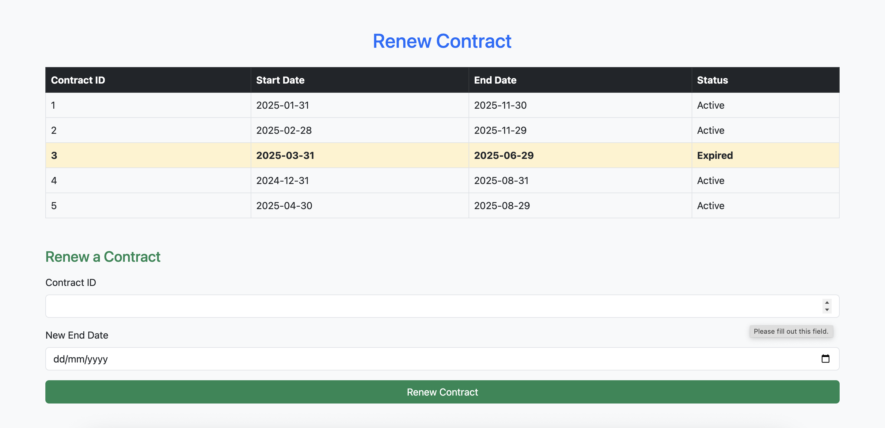
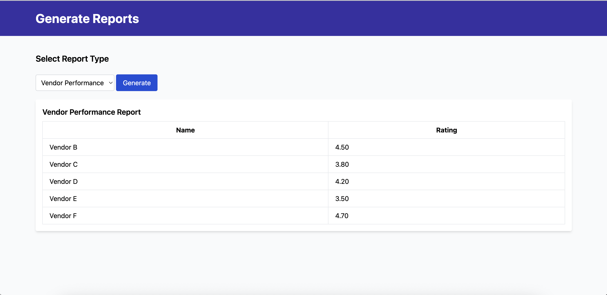

# Vendor and Contract Management System

> A comprehensive web-based solution designed to streamline vendor relationships, contract lifecycle management, and budget oversight with a robust Node.js backend and MySQL database.

## Overview

This platform provides an end-to-end system for managing vendors, contracts, budgets, and purchase orders. It includes secure user access, real-time tracking, performance evaluation, and insightful reporting.

## Key Features

- Vendor Management: Registration, profile updates, compliance tracking, and performance evaluation.
- Contract Management: Manual contract creation with automated renewal status updates and expiration alerts.
- Purchase Order Processing: PO generation linked with contracts and validated against budgets.
- Budget Monitoring: Allocation tracking, overspending prevention, and update operations.
- User Management & Authentication: Role-based access control for Managers, Teams, and Vendors.
- Reporting: Generate real-time reports on vendor performance, budget status, and contracts nearing expiration.

## Technologies Used

- Backend: Node.js, Express.js
- Database: MySQL
- Frontend: HTML, JavaScript, CSS

## Entity Relationship Diagram (ERD)

Located in the `Diagrams/` folder.  
Here is a preview:


## Project Structure

```
Vendor-and-Contract-Managenet-System/
├── node_modules/         # Node.js dependencies
├── Diagrams/             # Contains ERD and other system diagrams
├── manager/              # Frontend HTML/JS for Manager role
├── team/                 # Frontend HTML/JS for Team role
├── vendors/              # Frontend HTML/JS for Vendor role
├── login.html            # Main login page
├── purchase order.html   # Purchase order form
├── server.js             # Backend server (Express app)
├── vendordb.sql          # MySQL schema and seed data
├── package.json          # Project metadata and dependencies
├── package-lock.json     # Dependency lock file
└── .gitignore            # Files and folders ignored by Git
```

## UI Screenshots

Below are some interface screenshots of the platform.

### Manager Dashboard
Provides a high-level summary of contracts, budgets, and vendor activities.  


### Vendor Management
Add, evaluate, and track vendors with performance indicators.  


### Contract Renewal & Status Update
Update contract end dates and auto-switch status (Active, Renewal, Expired).  


### Budget Monitoring Panel
Track allocated vs spent budgets, avoid overspending.  


### Reports Overview
Access performance reports and contract renewal insights.  


### Team Dashboard
Team-level view of assignments, vendor interaction, and status updates.  


## Getting Started

1. Clone the repository:
   ```
   git clone https://github.com/faseey/Vendor-and-Contract-Managenet-System.git
   ```

2. Install dependencies:
   ```
   npm install
   ```

3. Set up the database:
   - Create a MySQL database named `vendordb`.
   - Import `vendordb.sql` into your MySQL server.

4. Configure database connection in `server.js`:
   ```js
   const db = mysql.createConnection({
     host: 'localhost',
     user: 'your-username',
     password: 'your-password',
     database: 'vendordb'
   });
   ```

5. Start the backend server:
   ```
   node server.js
   ```

6. Access the application in your browser:
   - Manager: `http://localhost:3000/manager`
   - Team: `http://localhost:3000/team`
   - Vendor: `http://localhost:3000/vendor`

## Contributing

We welcome contributions! Please fork the repository, create a feature branch, commit your changes with clear messages, and submit a pull request.

## Support & Contact

For support, bug reports, or feature requests, contact us through the GitHub repository or directly:

- Email: fasiih@gmail.com
- Bug Reports: [Open an Issue](https://github.com/faseey/Vendor-and-Contract-Managenet-System/issues)
- Feature Requests: [Start a Discussion](https://github.com/faseey/Vendor-and-Contract-Managenet-System/discussions)
